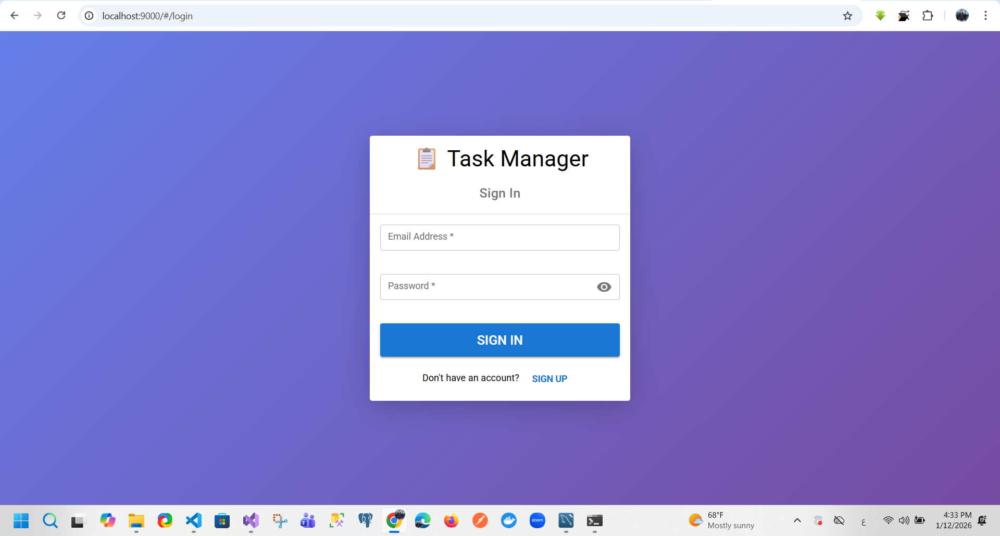
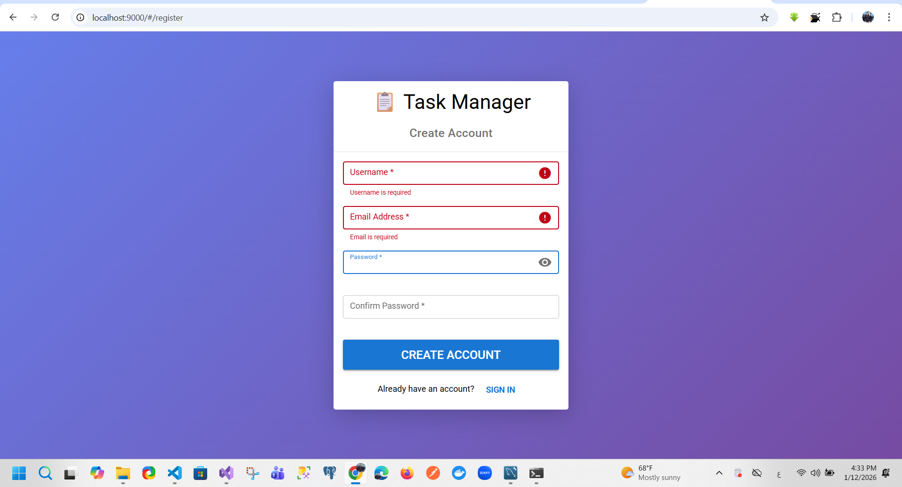
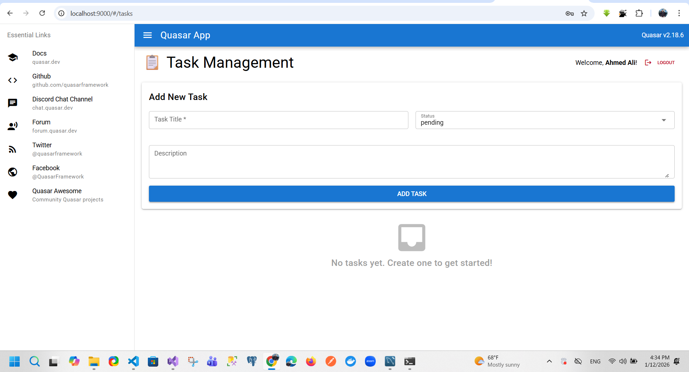
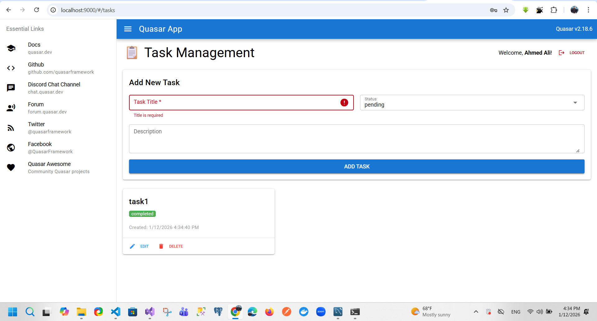
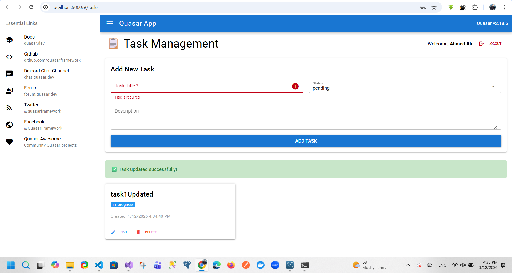
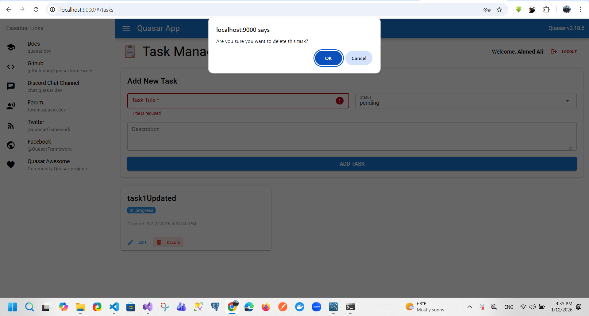
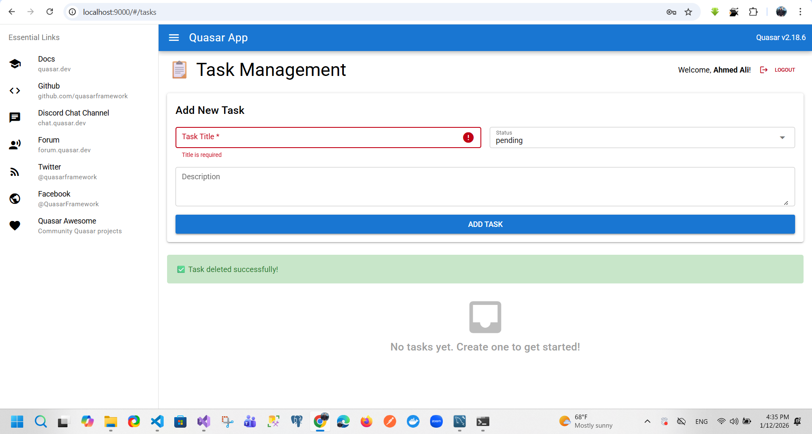

# 📋 Task Management App

A modern task management application built with **Vue.js 3 (Quasar)**, **Node.js**, **Express**, and **MySQL**. Features user authentication and full CRUD task management.


---

## 📸 Screenshots

### Login Page
[](./images/login.png)

### Register Page
[](./images/register.png)

### Tasks Dashboard
[](./images/tasks.png)

### TasksِAdded Page
[](./images/tasksِAdded.png)

### TasksِUpdated Page
[](./images/tasksِUpdated.png)

### TaskeDelete
[](./images/TaskeDelete.png)

### taskeDeleted
[](./images/taskeDeleted.png)

---

## ✨ Features

- ✅ User Registration & Login (JWT Authentication)
- ✅ Create, Read, Update, Delete Tasks
- ✅ Task Status Management (Pending, In Progress, Completed)
- ✅ Beautiful Responsive UI with Quasar
- ✅ Loading States & Error Handling
- ✅ Auto-dismissing Notifications

---

## 🛠 Tech Stack

- **Frontend:** Vue.js 3, Quasar Framework, SCSS
- **Backend:** Node.js, Express.js, JWT
- **Database:** MySQL
- **Security:** Bcryptjs password hashing

---

## 📁 Project Structure

```
task-management-app/
├── backend/              # Node.js Backend
│   ├── server.js        # Express server & API
│   ├── .env            # Database config
│   └── node_modules/
├── src/                 # Vue.js Frontend
│   ├── pages/
│   │   ├── LoginPage.vue
│   │   ├── RegisterPage.vue
│   │   └── TasksPage.vue
│   └── router/
└── README.md
```

---

## 🚀 Getting Started

### Prerequisites
- Node.js v20+
- MySQL 8+

### Backend Setup

```bash
cd backend
npm install
```

Create MySQL Database:
```sql
CREATE DATABASE IF NOT EXISTS task_management;
USE task_management;

CREATE TABLE users (
  id INT AUTO_INCREMENT PRIMARY KEY,
  username VARCHAR(255) NOT NULL UNIQUE,
  email VARCHAR(255) NOT NULL UNIQUE,
  password VARCHAR(255) NOT NULL,
  created_at TIMESTAMP DEFAULT CURRENT_TIMESTAMP
);

CREATE TABLE tasks (
  id INT AUTO_INCREMENT PRIMARY KEY,
  user_id INT NOT NULL,
  title VARCHAR(255) NOT NULL,
  description TEXT,
  status ENUM('pending', 'in_progress', 'completed') DEFAULT 'pending',
  created_at TIMESTAMP DEFAULT CURRENT_TIMESTAMP,
  updated_at TIMESTAMP DEFAULT CURRENT_TIMESTAMP ON UPDATE CURRENT_TIMESTAMP,
  FOREIGN KEY (user_id) REFERENCES users(id) ON DELETE CASCADE
);
```

Start Backend:
```bash
node server.js
```

### Frontend Setup

```bash
npm install
npm run dev
```

---

## 📖 API Endpoints

All task endpoints require JWT token in Authorization header:
```
Authorization: Bearer {token}
```

| Method | Endpoint | Description |
|--------|----------|-------------|
| POST | `/api/auth/register` | Register new user |
| POST | `/api/auth/login` | User login |
| GET | `/api/tasks` | Get all tasks |
| POST | `/api/tasks` | Create task |
| PUT | `/api/tasks/:id` | Update task |
| DELETE | `/api/tasks/:id` | Delete task |

---

## 🎯 How to Use

1. **Register** at `http://localhost:9000/#/register`
2. **Login** at `http://localhost:9000/#/login`
3. **Manage Tasks** - Add, Edit, Delete tasks
4. **Logout** - Click logout button in top right

---

## 🔐 Security

- Password hashing with bcryptjs
- JWT token-based authentication
- User isolation (users can only access their tasks)
- CORS protection

---

## 📝 License

MIT License - Feel free to use this project

---

## 👤 Author

**Eng. Abo Elhassan**

GitHub: [@AboElhassan-Mamdouh](https://github.com/AboElhassan-Developer)